# Deployment Guide

This guide covers the Docker setup and GitHub Actions CI/CD pipeline for ChatSphere.

## 🐳 Docker Setup

### Local Development with Docker

```bash
# Build and run development environment
npm run docker:dev

# Build and run production environment
npm run docker:prod

# Stop containers
npm run docker:down

# Build Docker image manually
npm run docker:build
```

### Docker Commands

```bash
# Build the Docker image
docker build -t chatsphere .

# Run the container
docker run -p 3000:3000 chatsphere

# Run with environment variables
docker run -p 3000:3000 \
  -e VITE_SUPABASE_URL=your_url \
  -e VITE_SUPABASE_ANON_KEY=your_key \
  chatsphere
```

## 🚀 GitHub Actions CI/CD Pipeline

### Pipeline Overview

The CI/CD pipeline is configured to:

1. **Run on every push to `main` branch**
2. **Run tests and build the application**
3. **Deploy to Vercel only if all tests pass**
4. **Use your provided Vercel webhook URL**

### Pipeline Jobs

#### 1. Test and Build Job
- Installs dependencies
- Runs linting
- Runs type checking
- Builds the application
- Tests the build locally

#### 2. Deploy Job (Main Branch Only)
- Triggers Vercel deployment webhook
- Only runs after successful test/build
- Provides deployment status

### Required GitHub Secrets

Add these secrets to your GitHub repository:

1. Go to your GitHub repository
2. Navigate to **Settings** → **Secrets and variables** → **Actions**
3. Add the following secrets:

```
VITE_SUPABASE_URL=https://tnvkyuqobuzrgsumuxtc.supabase.co
VITE_SUPABASE_ANON_KEY=sb_publishable_lQ53WcucGUBSsHRx3_05rw_abBUC9yc
```

### Vercel Integration

The pipeline uses your provided webhook URL:
```
https://api.vercel.com/v1/integrations/deploy/prj_bbkgO4Z6sv63LWVFNCQMRt2TUAZN/0FkGTslvWG
```

## 📋 Deployment Flow

```mermaid
graph LR
    A[Push to main] --> B[GitHub Actions]
    B --> C[Install Dependencies]
    C --> D[Run Linting]
    D --> E[Type Check]
    E --> F[Build App]
    F --> G[Test Build]
    G --> H{All Tests Pass?}
    H -->|Yes| I[Trigger Vercel Webhook]
    H -->|No| J[❌ Stop Pipeline]
    I --> K[✅ Deploy to Vercel]
```



## 🔧 Environment Variables

### Development
```bash
VITE_SUPABASE_URL=https://tnvkyuqobuzrgsumuxtc.supabase.co
VITE_SUPABASE_ANON_KEY=sb_publishable_lQ53WcucGUBSsHRx3_05rw_abBUC9yc
```

### Production
The same environment variables are used for production, automatically injected by the pipeline.

## 📁 File Structure

```
├── .github/
│   └── workflows/
│       ├── main.yml          # Main CI/CD pipeline
│       ├── deploy.yml        # Alternative deployment workflow
│       └── ci-cd.yml         # Full CI/CD with Docker
├── Dockerfile                # Production Docker image
├── Dockerfile.dev           # Development Docker image
├── docker-compose.yml       # Docker Compose configuration
├── .dockerignore           # Docker ignore file
└── DEPLOYMENT.md           # This file
```

## 🛠️ Troubleshooting

### Common Issues

1. **Build fails in GitHub Actions**
   - Check that all dependencies are in `package.json`
   - Verify environment variables are set correctly
   - Check the Actions logs for specific error messages

2. **Vercel deployment not triggered**
   - Ensure the webhook URL is correct
   - Check that the pipeline completed successfully
   - Verify the main branch is being pushed to

3. **Docker build fails**
   - Check Dockerfile syntax
   - Ensure all required files are present
   - Verify .dockerignore is not excluding necessary files

### Monitoring

- **GitHub Actions**: Check the Actions tab in your repository
- **Vercel**: Monitor deployments in your Vercel dashboard
- **Application**: Test the deployed application functionality

## 🔄 Manual Deployment

If you need to trigger a manual deployment:

```bash
# Trigger Vercel deployment webhook manually
curl -X POST \
  -H "Content-Type: application/json" \
  "https://api.vercel.com/v1/integrations/deploy/prj_bbkgO4Z6sv63LWVFNCQMRt2TUAZN/0FkGTslvWG"
```

## 📈 Next Steps

1. **Set up GitHub Secrets** with your Supabase credentials
2. **Push to main branch** to trigger the first deployment
3. **Monitor the pipeline** in GitHub Actions
4. **Check Vercel dashboard** for deployment status
5. **Test the deployed application** to ensure everything works

Your ChatSphere application will now automatically deploy to Vercel whenever you push to the main branch, but only if all tests and builds pass successfully!
